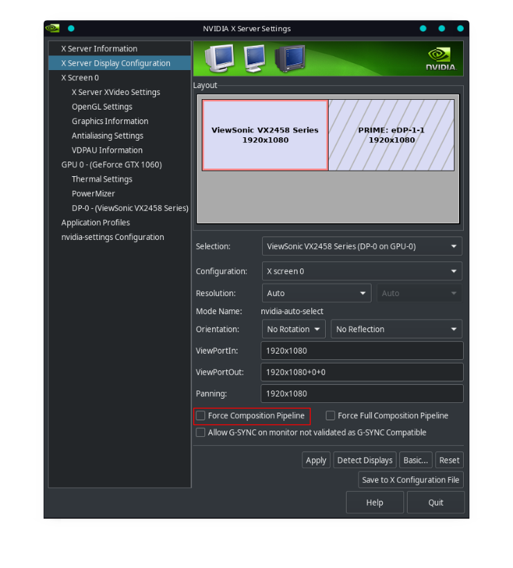

# nvidia-force-comp-pipeline

A simple script that auto-enables ForceCompositionPipeline on all monitors at startup.

## The ForceCompositionPipeline mode

### What is ForceCompositionPipeline ?

ForceCompositionPipeline is a special mode that can be enabled on monitors connected to Nvidia cards. It can be found in the Nvidia control panel : go to "X Server Display Configuration", select your monitor, click "Advanced".



### What does it do and why is it necessary ?

From my (limited) understanding, this mode forces all desktop compositing in Xorg to go through the general-purpose graphics pipeline of the Nvidia chip, instead of a dedicated engine dedicated to display.

This Reddit comment (by an Nvidia developer) gives a more in-depth explanation : https://www.reddit.com/r/linux_gaming/comments/6voivr/can_anyone_explain_what_force_composition/dm1uz2j/

The main advantage of enabling this mode on Linux is that it can solve tearing issues that are unfortunately pretty common with Nvidia cards. With KDE Plasma for example, I have never found a way to completely get rid of tearing on Nvidia without enabling ForceCompositionPipeline.

### Is there any drawback to enabling it ?

According to the Reddit comment linked above, this mode increases the strain on your GPU (since you are not using the hardware part dedicated to display), which may impact performance. I do not know if that also applies to fullscreen games, since compositing is theoretically disabled that case.

It may also increase input lag, although there are conflicting reports on that point. If anyone has ever done a proper testing (with actual numbers) of input latency with that mode enabled, I would really like to know the results (qualitative reports such as "it feels more/less snappy" are not very useful since there is way to much room for placebo in the equation).

## Installation

```
git clone https://github.com/Askannz/nvidia-force-comp-pipeline
cd nvidia-force-comp-pipeline/
sudo cp nvidia-force-comp-pipeline /usr/bin/
sudo cp nvidia-force-comp-pipeline.desktop /etc/xdg/autostart/
```

This should work on any desktop environment that follows the Freedesktop specifications. The script will be automatically launched at session startup.

## Known issues

### PRIME monitors

ForceCompositionPipeline does *not* work with monitors that show up up as "PRIME" in the Nvidia control panel (the screenshot above gives an example). A PRIME monitor is not directly connected to the Nvidia GPU but goes through another GPU first. This type of configuration can be found in gaming laptops (the "Optimus" setup) or in desktop computers that have an integrated GPU in their motherboard.

PRIME monitors can have tearing problems too, but the cause is entirely different. To fix the tearing, you should not look into enabling ForceCompositionPipeline but [PRIME Sync](https://devtalk.nvidia.com/default/topic/957814/linux/prime-and-prime-synchronization/) instead.

### DPI

Enabling ForceCompositionPipeline seems to randomly mess with the DPI settings of X11 (on my KDE desktop at least), which causes texts to suddenly become too small or the window decorations to overflow.

If you experience this as well, the fix is to set the DPI setting directly as an argument to the X server. On KDE, this can be achieved by adding the following section to `/etc/sddm.conf` (create the file if it does not exist) :

```
[X11]
ServerArguments=-nolisten tcp -dpi 96
```

Replace 96 by your desired DPI value.

### Multiple Nvidia GPUs

The script will probably not work on setups that have multiple monitors connected to different Nvidia GPUs. This is because it parses the output of `nvidia-settings` to get the current monitor metamode, and I have no idea what the format of that is with multiple GPUs.

 If you are in that situation, send me the output of the command `nvidia-settings -q CurrentMetaMode` on your machine and I'll update the script.

